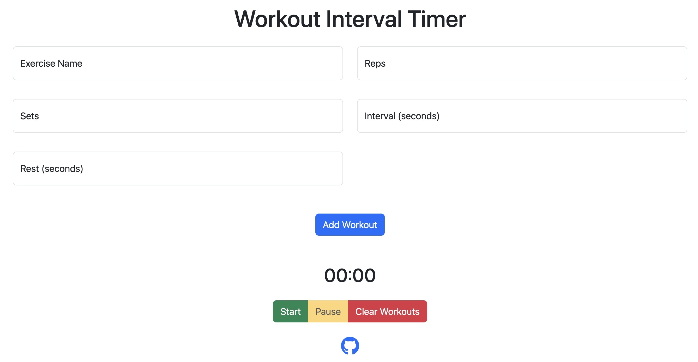

# Interval Workout Timer Application

This document provides a brief overview of the Interval Workout Timer application and its usage.

## Overview

The Interval Workout Timer is a web-based application designed to help you manage your interval workouts effectively. With this application, you can easily keep track of your workout intervals and rest periods, ensuring you have an efficient and productive exercise session.

## Usage

To use the Interval Workout Timer application, follow these simple steps:

1. Ensure that `workout_timer.html`, `workout_timer.css`, `workout_timer.js`, and `favicon.png` files are located in the same folder.
2. Open the `workout_timer.html` file in your preferred web browser.
3. The application should load, and you can now start using the Interval Workout Timer.

## Live Demo

You can try out the Interval Workout Timer application by visiting the live demo at the following link:

[Interval Workout Timer Live Demo](https://www.codefreelance.net/apps/workout_timer)

**Note**: For the best experience, we recommend using the latest version of Google Chrome, Mozilla Firefox, or Microsoft Edge.

Happy exercising!
